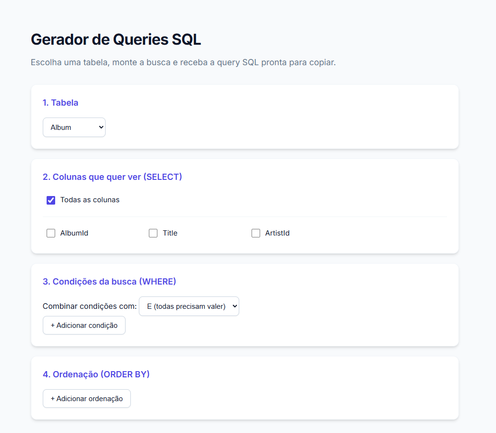
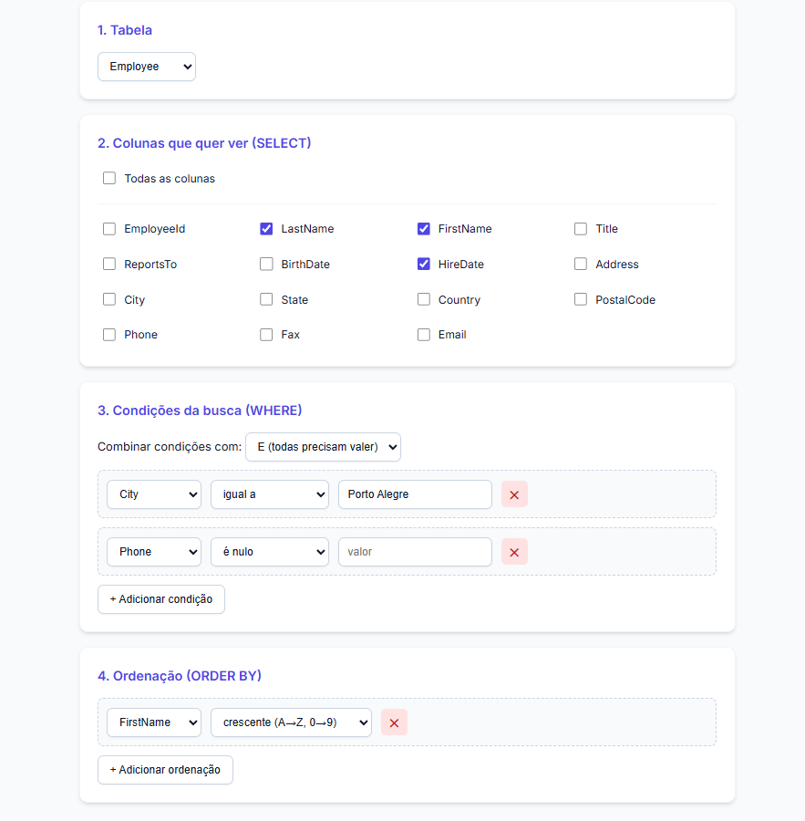
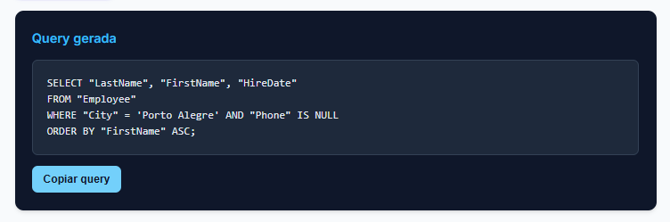

# Gerador de queries SQL

Este programa tem como objetivo facilitar a criação de queries para o usuário de forma que ele apenas precise selecionar a tabela, colunas, filtros e por fim a ordenação da lista. 
Com isso, o usuário recebe a query montada pronta para rodar.

## Como abrir

O programa roda no seu computador e é acessado pelo navegador. Para abri-lo, você precisa do **.NET 10 SDK** instalado (download em https://dotnet.microsoft.com/download). Não é necessário instalar nenhum banco de dados.

1. Baixe o projeto: na página do repositório, clique em **Code > Download ZIP** e extraia a pasta (ou use `git clone`).
2. Abra um terminal dentro da pasta `QueryGenerator.Api`.
3. Execute o comando:
```
   dotnet run
```
4. Quando o programa iniciar, o terminal mostra uma linha parecida com `Now listening on: http://localhost:5013`. Abra no navegador o endereço que aparecer aí. O número da porta (no exemplo, 5013) pode ser diferente no seu computador.
5. Para encerrar o programa, volte ao terminal e pressione `Ctrl + C`.



## Como usar

 - Selecione qual tabela você deseja consultar;
 - Selecione quais colunas você deseja visualizar, pode marcar a opção "Todas as colunas" caso queira ver a tabela completa;
 - Escolha os filtros que a query deve ter, selecionando a coluna e o que o filtro deve fazer, o programa inclui 11 tipos diferentes de filtros, por fim, coloque o valor do filtro;
 - Selecione qual ou quais colunas você deseja usar para a ordenação da lista, podendo escolher entre ordenar por ordem "Crescente" ou "Decrescente";
 - Por último clique em "Gerar query" e receba a query completa pronta para rodar.

Exemplo: O chefe de uma empresa quer saber o nome e sobrenome e a data de contratação dos empregados que possui que moram em Porto Alegre e que não possuem um número de telefone cadastrado no sistema, ordenando eles pelo nome em ordem crescente.

Primeiro ele deve selecionar a tabela "Employee", depois deve selecionar as colunas "FirstName", "LastName" e "HireDate", após isso deve criar duas condições de busca no WHERE, a primeira ele irá selecionar a coluna "City", depois marcar "igual a" e por fim colocar no campo valor "Porto Alegre", feito o primeiro filtro, ele deve clicar em "+ Adicionar condição" e repetir o processo, só que agora selecionando a coluna "Phone" e marcar a opção "é nulo" deixando o campo "valor" vazio. Por último ele deve clicar em "+ Adicionar ordenação" na seção "4. Ordenação (ORDER BY)" e selecionar a coluna "FirstName" e escolher a opção de ordenação "crescente (A -> Z, 0 -> 9)". Após ter selecionado todas as opções para montar a query, basta clicar em "Gerar query" para receber ela pronta.



```sql
SELECT "LastName", "FirstName", "HireDate"
FROM "Employee"
WHERE "City" = 'Porto Alegre' AND "Phone" IS NULL
ORDER BY "FirstName" ASC;
```

Para copiar a query, use o botão "Copiar query" que aparece logo abaixo dela.



## Como combinar condições

Quando você adiciona mais de uma condição, o campo "Combinar condições com" define como elas se juntam:

 - **E (todas precisam valer):** a linha só aparece se atender a todas as condições. É o que foi usado no exemplo acima.
 - **OU (basta uma valer):** a linha aparece se atender a pelo menos uma das condições.

## O que significa cada filtro

 - **igual a**, **diferente de**: comparam o valor da coluna com o que você digitou.
 - **maior que**, **menor que**, **maior ou igual a**, **menor ou igual a**: servem para números e datas. Exemplo: "Total maior que 10".
 - **contém**: procura o texto em qualquer parte do valor. "Bra" encontra "Brazil".
 - **LIKE**: parecido com "contém", mas você controla a posição usando o símbolo `%`, que vale por "qualquer coisa". `Bra%` encontra o que começa com "Bra", e `%il` o que termina com "il".
 - **NOT LIKE**: o contrário do LIKE, ou seja, traz o que não combina com o padrão.
 - **é nulo**: encontra linhas em que a coluna está vazia (sem valor cadastrado). Nesse caso, deixe o campo "valor" em branco.
 - **não é nulo**: o contrário, traz só as linhas em que a coluna tem algum valor.

## Sobre o banco de dados

O programa vem com o **Chinook**, um banco de dados de exemplo que representa uma loja de músicas digitais. Ele tem tabelas como `Customer` (clientes), `Employee` (funcionários), `Album`, `Artist` e `Track` (músicas).

O banco fica em um único arquivo, `Chinook.sqlite`, dentro da pasta `QueryGenerator.Api/Data`. Ele usa SQLite, por isso não é preciso instalar nem configurar nada. O programa apenas lê o banco, então nada do que você fizer altera os dados.

O Chinook é um projeto aberto criado por Luis Rocha: https://github.com/lerocha/chinook-database

## Limitações

 - O programa consulta **uma tabela por vez**, ou seja, não faz junção entre tabelas (JOIN).
 - Ele **gera a query, mas não a executa**: para ver o resultado, copie o SQL e rode no seu banco.
 - A query segue a sintaxe do SQLite. Em outros bancos, como o SQL Server, pode ser necessário um pequeno ajuste.
 - Por enquanto, só o banco de exemplo Chinook está disponível.
